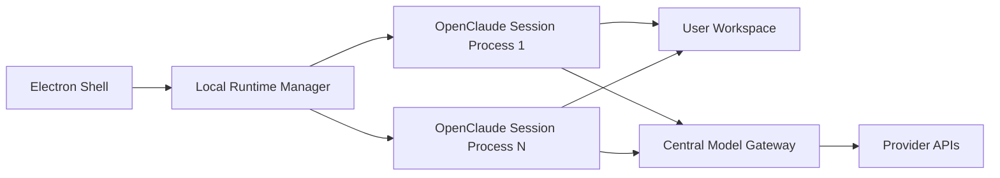

# OpenClaude Desktop Beta Architecture

## Goal

Ship a closed beta desktop app for 5-10 users that feels like a real coding product:

- downloadable `.app` / `.dmg`
- no manual terminal setup
- no user-managed provider API keys
- one app shell that launches and keeps backend agent sessions alive
- centralized model routing and billing on our backend

This document is the working blueprint for the first installable beta.

## Product Decisions

### Included in beta

- macOS-first desktop app via Electron
- local multi-session shell over OpenClaude's `stream-json` backend
- centralized model catalog
- centralized provider keys and routing
- local workspace selection
- chat, streaming status, permissions, and logs

### Deliberately excluded from beta

- user sign-in and account system
- self-serve billing
- team management
- cloud worktrees / remote sandboxes
- deep plugin marketplace or public extensions

The beta can be invite-only and distributed manually.

## Why Electron

Electron is the fastest path from the current working shell to an installable app:

- we already have a Node runtime and browser UI
- the OpenClaude backend is already process-oriented
- Electron gives us packaging, app lifecycle, dialogs, keychain access, and auto-update paths later

Tauri can be reconsidered after beta if app size and idle memory become priority concerns.

## Design Direction

The target should not imitate the current prototype visuals. The product should borrow the interaction patterns from official Codex and ChatGPT surfaces while keeping its own brand.

Official references used:

- [Codex product page](https://openai.com/codex/)
- [Introducing the Codex app](https://openai.com/index/introducing-the-codex-app/)
- [ChatGPT desktop](https://chatgpt.com/features/desktop)
- [Codex in ChatGPT help overview](https://help.openai.com/en/articles/11369540-codex-in-chatgpt)

### UI patterns to carry over

- left rail for workspaces, sessions, and agent runs
- central thread for prompt, streamed progress, artifacts, and review loop
- supporting side panel for context, permissions, diff, and runtime state
- quiet typography and restrained motion
- productivity-first states rather than marketing-heavy cards

### First design token pass

- Surface:
  - app background: deep blue-black
  - primary panel: low-contrast glass or matte charcoal
  - secondary panel: slightly lifted neutral
- Typography:
  - display: editorial serif only for sparse section headings
  - UI text: clean sans with strong legibility
  - code: mono with generous spacing
- Interaction:
  - rounded panels, but not toy-like
  - warm accent for primary action
  - cool accent for active state and progress
- Motion:
  - only meaningful transitions
  - streamed assistant updates should feel stable, not flashy

## High-Level Architecture



## Runtime Layers

### 1. Electron Shell

Responsibilities:

- app window
- lifecycle
- workspace picker
- native menu, dock, deep links later
- keychain access later
- local runtime boot and shutdown

Current files:

- [desktop/main.mjs](/Users/tkanduev/Documents/GigaWork/openclaude/desktop/main.mjs)
- [desktop/preload.cjs](/Users/tkanduev/Documents/GigaWork/openclaude/desktop/preload.cjs)

### 2. Local Runtime Manager

Responsibilities:

- create and track sessions
- launch OpenClaude child processes in `stream-json` mode
- fan out backend events to the UI
- broker permission requests
- keep local logs
- maintain recent sessions and workspace metadata

Current base:

- [scripts/app-launcher.mjs](/Users/tkanduev/Documents/GigaWork/openclaude/scripts/app-launcher.mjs)

This layer must become workspace-aware. The current prototype still assumes the product repo as the runtime cwd for some ops and that needs to be retired for the beta app flow.

### 3. OpenClaude Session Processes

Each session runs a child process roughly like:

```bash
node dist/cli.mjs -p \
  --input-format stream-json \
  --output-format stream-json \
  --verbose \
  --include-partial-messages \
  --session-id <uuid>
```

The session process should run with:

- selected user workspace as `cwd`
- centralized gateway base URL
- model alias or routed model name
- no provider keys exposed to the renderer

### 4. Central Model Gateway

Responsibilities:

- expose one OpenAI-compatible endpoint
- map UI model aliases to upstream providers
- select the correct private API key
- enforce quotas, rate limits, and kill switches
- record usage and cost centrally

Suggested config shape:

```json
{
  "models": [
    {
      "alias": "chatgpt-gpt-4o-mini",
      "label": "ChatGPT · GPT-4o mini",
      "provider": "openai",
      "upstreamModel": "gpt-4o-mini",
      "keyId": "openai_primary",
      "baseUrl": "https://gateway.example.com/v1",
      "capabilities": ["chat", "tools", "stream"]
    }
  ]
}
```

Important naming rule:

- the client should expose explicit provider/model choices
- avoid abstract names like `Fast`, `Balanced`, or `Reasoning`

The client should never know which real provider key is being used.

## Beta Auth Model

For this closed beta, skip user sign-in.

Recommended beta access model:

- app build contains only the gateway base URL
- each beta tester receives an invite code or device token
- the local app exchanges that for a short-lived session token
- the token authorizes access to the gateway model catalog

If we want the absolute fastest possible closed beta, we can even skip the invite code exchange and hardcode a beta bearer token in a privately distributed build. This is intentionally temporary and acceptable only because the audience is 5-10 trusted testers.

## Workspace Model

The product runtime should separate three roots:

- app root: bundled product files
- workspace root: user-selected code directory
- app data root: local settings, logs, caches, session index

### Required changes

- stop using the product repo root as the session cwd
- add "Choose Workspace" flow in Electron
- persist recent workspaces under user data
- keep runtime logs outside the selected workspace

## Packaging Strategy

Use `electron-builder`.

Current packaging files:

- [electron-builder.yml](/Users/tkanduev/Documents/GigaWork/openclaude/electron-builder.yml)

Key points:

- ship `dist/cli.mjs`, `launcher-ui`, `scripts/app-launcher.mjs`, and desktop files
- unpack runtime files needed by child processes
- use Electron's own executable with `ELECTRON_RUN_AS_NODE=1` for backend child sessions

## Data Flow

### Session start

1. Electron boots local runtime.
2. User selects workspace and model.
3. Runtime creates a session record.
4. Runtime spawns OpenClaude child process.
5. Runtime sends `initialize`.
6. UI subscribes to state and session events.

### Prompt flow

1. Renderer posts user prompt.
2. Runtime forwards NDJSON user message to the session process.
3. Session process streams `stream_event`, `assistant`, `tool_progress`, `result`.
4. Runtime normalizes and stores transcript state.
5. Renderer renders transcript and side panel updates.

### Permission flow

1. Session emits `control_request.can_use_tool`.
2. Runtime persists pending permission.
3. UI renders allow/deny card.
4. User decides.
5. Runtime sends `control_response`.

## Desktop Milestones

### Milestone 1: Installable shell

- Electron app boots the local runtime
- packaged `.app` opens successfully
- browser shell runs inside native window

### Milestone 2: Workspace-first app

- workspace picker
- recent workspaces
- session cwd decoupled from app root

### Milestone 3: Gateway-backed catalog

- centralized model aliases
- one endpoint for all model choices
- no provider keys in client UI

### Milestone 4: UX polish

- redesigned shell aligned to Codex / ChatGPT interaction patterns
- review mode and artifact panels
- empty/loading/error/offline states

### Milestone 5: Beta distribution

- signed mac build if needed
- `.dmg` release process
- crash logging and support flow

## Immediate Code Tasks

1. Move the current shell from "repo control panel" toward "workspace coding app".
2. Add workspace selection to session creation.
3. Replace the current visual design with a real design-system pass.
4. Introduce model catalog API instead of raw API-key fields in the UI.
5. Add a thin gateway contract for `list models`, `start session`, and routed requests.

## Main Risks

### App/runtime coupling

The current prototype still mixes product runtime logic with repo-maintenance actions. Those need to be split before shipping the beta.

### Secret handling

Even in a small beta, real provider keys must stay server-side.

### Packaged child processes

Spawned OpenClaude sessions need stable access to bundled runtime files after packaging. This is why the Electron integration uses an explicit app root and Node-mode child execution.

### UX scope creep

A closed beta should prove:

- installability
- session reliability
- routed model access
- useful day-to-day editing flow

It does not need every Codex feature from day one.
